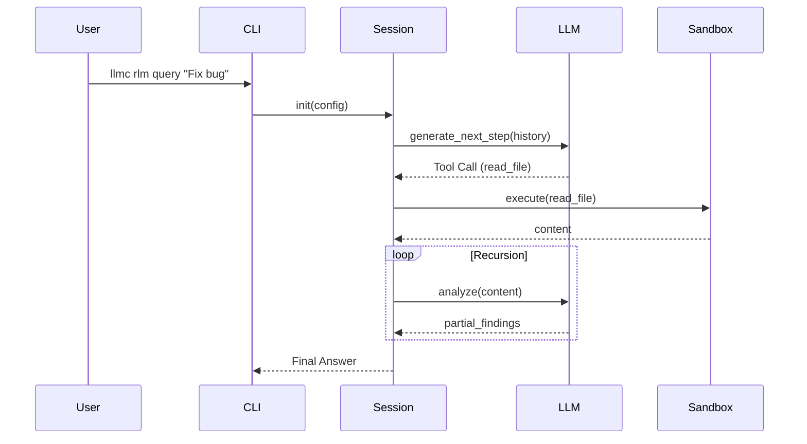

# RLM Phase 1.3 - Documentation & Examples Implementation Plan

**Branch:** feature/rlm-docs-1aa
**Priority:** P2
**Total Effort:** 4-6 hours
**Acceptance Criteria:**
- ✅ User guide created with 5+ real examples
- ✅ Architecture doc created with session loop diagrams
- ✅ API reference complete (CLI + Python + MCP)
- ✅ Example scenarios tested and verified working
- ✅ Docs linked from main index

---

## Task List

### Phase 1: Setup & Structure
- [ ] **Task 1.1:** Create documentation directory structure
  - **Effort:** 5m
  - **Parallelizable:** NO
  - Create `DOCS/guides/` (if sticking to roadmap) or `DOCS/user-guide/rlm/`
  - Create `DOCS/architecture/` (exists)
  - Create `DOCS/reference/` (exists)
  - **Goal:** Ensure places for files exist.
  - **Reference:** `DOCS/ROADMAP.md`

- [ ] **Task 1.2:** Update Main Documentation Index
  - **Effort:** 10m
  - **Parallelizable:** YES (can happen anytime)
  - Edit `DOCS/index.md`
  - Add "RLM Agent" section linking to new docs
  - **Reference:** `DOCS/index.md`

### Phase 2: User Guide (`DOCS/user-guide/rlm.md`)
- [ ] **Task 2.1:** Write "Introduction & Concepts" section
  - **Effort:** 20m
  - **Parallelizable:** YES
  - Content: What is RLM? (Recursive Language Model)
  - Content: When to use RLM vs regular RAG search
  - **Reference:** `llmc/rlm/session.py` (docstring)

- [ ] **Task 2.2:** Write "Configuration & Budgeting" section
  - **Effort:** 25m
  - **Parallelizable:** YES
  - Content: Explaining `llmc.toml` [rlm] section
  - Content: How budget limits work (USD, tokens, depth)
  - **Reference:** `llmc/rlm/config.py`, `llmc/rlm/governance/budget.py`

- [ ] **Task 2.3:** Write "Troubleshooting" section
  - **Effort:** 15m
  - **Parallelizable:** YES
  - Content: Common errors (BudgetExceeded, SandboxTimeout)
  - Content: How to read trace logs
  - **Reference:** `llmc/rlm/session.py`

### Phase 3: Architecture Documentation (`DOCS/architecture/rlm.md`)
- [ ] **Task 3.1:** Write "Component Overview"
  - **Effort:** 20m
  - **Parallelizable:** YES
  - Content: Session Manager, Token Budget, Sandbox, Navigation
  - **Reference:** `llmc/rlm/session.py`, `llmc/rlm/sandbox/interface.py`

- [ ] **Task 3.2:** Create Session Loop Diagram (Mermaid)
  - **Effort:** 25m
  - **Parallelizable:** YES
  - Content: Sequence diagram showing User -> CLI -> Session -> LLM -> Sandbox -> Result
  - **Reference:** `llmc/rlm/session.py` (run method)

- [ ] **Task 3.3:** Document "State Management & Sandbox"
  - **Effort:** 20m
  - **Parallelizable:** YES
  - Content: How state is preserved between turns
  - Content: Sandbox security model (Process vs RestrictedPython)
  - Content: V1.1.0 vs V1.1.1 changes (Budget enforcement)

### Phase 4: API Reference (`DOCS/reference/rlm_api.md`)
- [ ] **Task 4.1:** Document CLI Commands
  - **Effort:** 15m
  - **Parallelizable:** YES
  - Content: `llmc rlm query` arguments and options
  - **Reference:** `llmc/commands/rlm.py`

- [ ] **Task 4.2:** Document Python API
  - **Effort:** 20m
  - **Parallelizable:** YES
  - Content: `RLMSession`, `RLMConfig`, `RLMResult` classes
  - **Reference:** `llmc/rlm/session.py`

- [ ] **Task 4.3:** Document MCP Tool Signature
  - **Effort:** 15m
  - **Parallelizable:** YES
  - Content: `rlm_analyze` tool schema (JSON)
  - **Reference:** `llmc/rlm/entrypoint.py` (or wherever tool definition lives)

### Phase 5: Example Scenarios (`DOCS/user-guide/rlm-examples.md`)
- [ ] **Task 5.1:** Create "Performance Analysis" Scenario
  - **Effort:** 30m
  - **Parallelizable:** NO (Needs verification)
  - Content: Example of analyzing `fibonacci` code (from tests)
  - **Reference:** `tests/rlm/test_integration_deepseek.py`

- [ ] **Task 5.2:** Create "Refactoring" Scenario
  - **Effort:** 30m
  - **Parallelizable:** YES
  - Content: Example of asking RLM to refactor a messy function
  - **Verification:** Must run `llmc rlm query ...` to capture real output

- [ ] **Task 5.3:** Create "Bug Investigation" Scenario
  - **Effort:** 30m
  - **Parallelizable:** YES
  - Content: Example of finding a subtle bug
  - **Verification:** Must run `llmc rlm query ...` to capture real output

- [ ] **Task 5.4:** Verify all examples
  - **Effort:** 30m
  - **Parallelizable:** NO
  - Run the commands documented in tasks 5.1-5.3
  - Ensure output matches documentation
  - Ensure budget stays within limits

### Final Verification
- [ ] **Task 6.1:** Documentation Build/Link Check
  - **Effort:** 15m
  - **Parallelizable:** NO
  - Verify all internal links work
  - Verify Mermaid diagrams render correctly in preview

---

## Implementation Guidance

### Mermaid Diagram Template
Use this structure for Task 3.2:

### Documentation Tone
- **User Guide:** Helpful, tutorial-style, "How-to".
- **Architecture:** Technical, precise, justificatory.
- **Reference:** Dry, complete, accurate.

### Key Files to Reference
- `llmc/rlm/session.py`: The source of truth for the loop.
- `llmc/rlm/config.py`: The source of truth for configuration.
- `tests/rlm/test_integration_deepseek.py`: Source of working examples.
