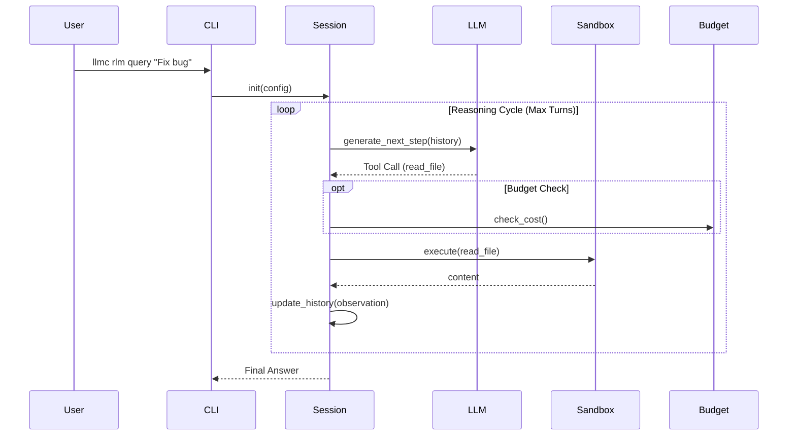

# RLM Architecture

The **Recursive Language Model (RLM)** is a stateful, agentic runtime designed for deep code analysis. It operates as a "Loop inside a Sandbox".

---

## 🏗️ High-Level Components

### 1. Session Manager (`RLMSession`)
The core orchestrator. It maintains:
- **Chat History**: The conversation log between the User, System, and Agent.
- **Budget**: The generic ledger tracking token costs.
- **State**: Variables preserved across turns.

### 2. The Loop (ReAct / OODA)
RLM follows a structured reasoning loop:
1.  **Observe**: Read current history and tool outputs.
2.  **Orient**: Analyze the situation (LLM inference).
3.  **Decide**: Choose the next action (Tool call or Final Answer).
4.  **Act**: Execute the tool in the Sandbox.

### 3. The Sandbox (`ProcessSandboxBackend`)
A secure environment where the Agent executes "actions".
- **Backend**: Currently uses `subprocess` (local python execution).
- **Isolation**: Tools are injected as "built-ins". The agent writes Python code that calls these tools.
- **Safety**:
    - **Timeouts**: Hard limits on execution time.
    - **Memory**: Output size limits.
    - **Module Allowlist**: Prevents importing dangerous modules (if configured).

### 4. Navigation Tools (`TreeSitterNav`)
RLM doesn't just "grep". It uses Tree-sitter to understand code structure:
- **`nav_find_definition`**: Jump to class/function def.
- **`nav_find_references`**: Find usages.
- **`read_file`**: Intelligent reading (supports partial reads).

---

## 🔄 The Session Loop

---

## 🔐 Security Model

### 1. Budget Enforcement
To prevent "runaway agents" (infinite loops of API calls), RLM uses a strict dual-budget system:
- **USD Limit**: Hard cap on estimated cost (e.g., $1.00).
- **Token Limit**: Hard cap on total tokens sent/received.
- **Depth Limit**: Prevents infinite recursion (if sub-agents are used).

### 2. Path Policy (MCP Integration)
When running via MCP (Model Context Protocol), RLM adheres to the server's security context:
- **`allowed_roots`**: Can only read files within the specified workspace.
- **`denylist`**: Sensitive files (`.env`, `id_rsa`) are blocked at the tool level.
- **`max_bytes`**: Large files are truncated to prevent context window DoS.

### 3. Egress Control
By default, RLM running inside MCP is **local-only** (Restricted Profile).
- **Network Access**: Blocked.
- **Model Overrides**: Disabled (cannot force usage of GPT-4 if policy dictates Ollama).

---

## 💾 State Management

RLM is **stateless** between CLI invocations but **stateful** within a session.

- **Conversation History**: Stored in-memory list of `Message` objects.
- **Sandbox State**: The `ProcessSandboxBackend` is ephemeral. Variables defined in one turn *may* not persist to the next depending on backend implementation. (Current Phase 1 implementation treats each tool execution as atomic).

---

## 🧩 Future: Recursive Sub-Agents

The "Recursive" in RLM refers to its ability to spawn sub-sessions:
1.  Root Agent plans a task.
2.  Delegates "Research networking code" to a Sub-Agent.
3.  Sub-Agent has its own isolated history and smaller budget.
4.  Sub-Agent returns a summary to Root Agent.

*(Note: Phase 1 implements the linear loop. Recursive calls are planned for Phase 2).*
