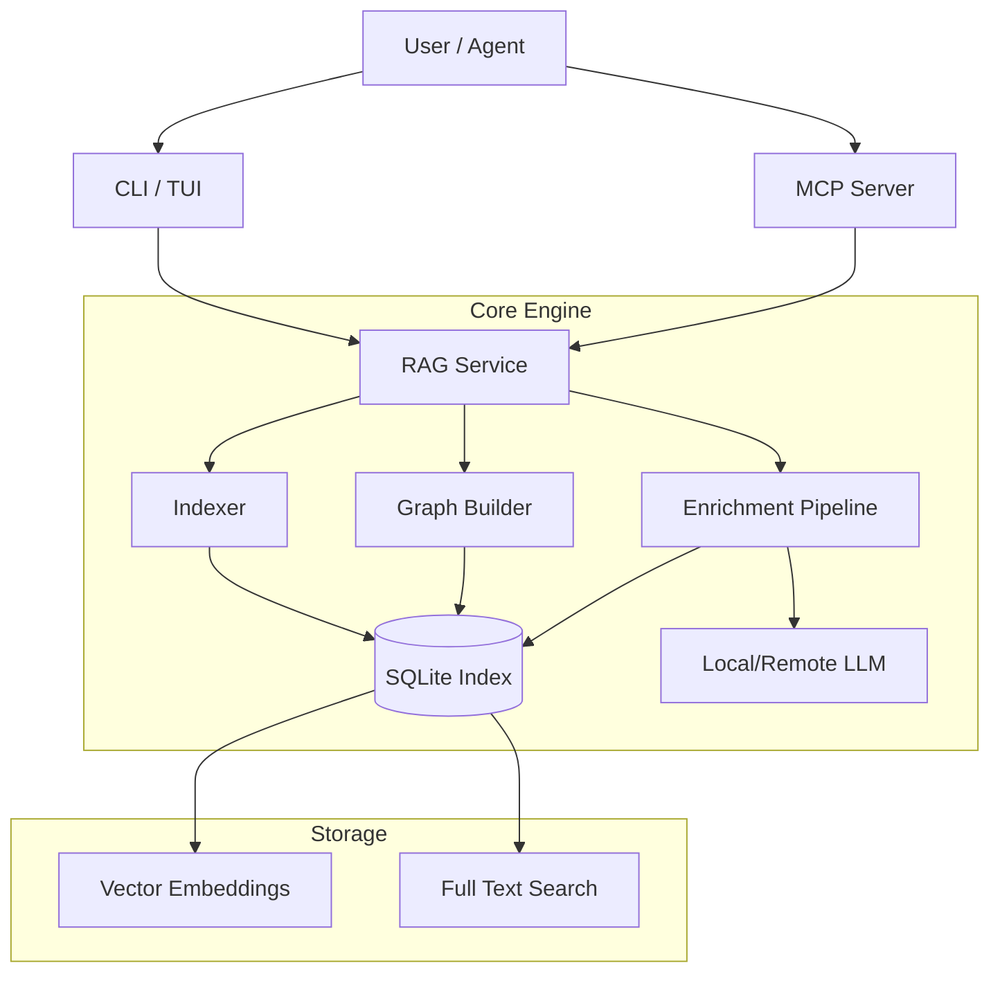

# Architecture Overview

LLMC is a modular system designed for local-first code intelligence.

## System Diagram

## Key Components

### 1. The RAG Engine
The core database (`index_v2.db`) stores:
- **Files**: Metadata and hashes.
- **Spans**: Sliced code blocks (functions, classes).
- **Embeddings**: Vector representations of spans.
- **Enrichment**: LLM-generated summaries linked to spans.

### 2. The Service Layer
- **Daemon**: Schedules background tasks.
- **Locking**: Ensures safe concurrent access to the SQLite DB.
- **Freshness**: Tracks state to prevent "stale reads".

### 3. The Router & Enrichment
- **Router**: Decides how to process a file (e.g., `.py` vs `.md`).
- **Chain**: A sequence of steps (e.g., "Summarize" -> "Tag").
- **Tier**: Which model to use (e.g., `7b` local vs `gpt-4` remote).

### 4. Interfaces
- **CLI**: For human operators.
- **TUI**: For monitoring and inspection.
- **MCP**: For AI agents (Claude, IDEs).

## Data Flow

1.  **Ingest**: Daemon detects file change.
2.  **Slice**: AST parser breaks file into Spans.
3.  **Embed**: Vector model computes embeddings for changed Spans.
4.  **Enrich**: LLM generates summary for Spans.
5.  **Query**: Agent asks question -> Search finds relevant Spans -> Context window constructed.