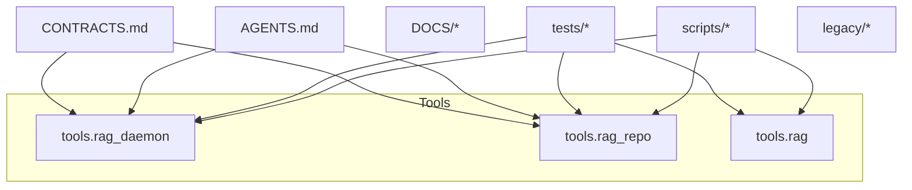

# SDD – LLMC-6 Repository Structure & Cleanup

## TL;DR

This SDD defines the **repository-level structure** for LLMC-6:

- Keep runtime logic concentrated under `tools/`.
- Use `scripts/` only for thin operational wrappers.
- Introduce `legacy/` as a quarantine for deprecated code.
- Ship clear docs (`README.md` + `DOCS/*`) so future work and OSS release are sane.

Goal: make LLMC-6 **shippable tomorrow** without risky refactors, while setting a stable
baseline for future polish.

---

## Problem statement

The LLMC ecosystem has gone through several iterations:

- Old development repos with experiments, early daemons, and “one-off” scripts.
- A newer LLMC-6 repo that is more cohesive, but still missing:
  - A clear **top-level layout** and README.
  - An explicit **legacy quarantine** for backup/old files.
  - A single SDD describing how this repo fits into the greater LLMC picture.

Without a clean structure, onboarding (including your future self) is slow, and automation
(e.g., CI, release pipelines) has to guess where the “real” entry points live.

---

## Goals

1. **Clarity** – A newcomer can skim the tree + README and understand the main components.
2. **Safety** – Old/experimental code is fenced off in `legacy/`, not mixed with live paths.
3. **Minimal change risk** – Do not move or rename runtime modules (`tools/*`) before launch.
4. **Documentation first** – Prefer *explaining* the current layout over rewriting it.

Non-goals for this SDD:

- Converting LLMC-6 into a mono-repo.
- Renaming packages (e.g., `tools.*` → `llmc_core.*`) right before release.
- Reworking every script into a polished CLI.

---

## Current architecture (high level)

The LLMC-6 repo contains three main Python “pillars”:



- `tools.rag_daemon` – the long-running orchestration layer.
- `tools.rag_repo` – repo/tooling surface for inspecting and operating on a workspace.
- `tools.rag` – core RAG logic (planning, schema, quality, search, workers, etc.).

Supporting pieces:

- `scripts/*` – operational wrappers (tmux, cron, quick helpers).
- `tests/*` – basic test coverage for the daemon and repo tool.
- `DOCS/*` – system overview + SDDs for daemon and repo.
- `AGENTS.md` / `CONTRACTS.md` – behavioral definitions used by higher-level wrappers.

---

## Target repo layout

Target high-level layout after cleanup:

```text
./
├─ .github/                 # CI / automation
├─ AGENTS.md                # agent definitions
├─ CONTRACTS.md             # contracts + expectations
├─ DOCS/                    # system docs, SDDs, tests docs, prompts
├─ legacy/                  # deprecated/backup code, not imported
├─ scripts/                 # operational wrappers, no core logic
├─ tests/                   # pytest tests for daemon + repo
├─ tools/                   # runtime logic (rag, daemon, repo)
├─ llmc.toml                # configuration entry point
├─ pyproject.toml           # packaging
└─ README.md                # repo-level overview
```

Design principles:

- **Runtime code lives in `tools/`** – no new “core” packages until after launch.
- **Scripts are thin** – they should call into `tools.*`, not implement business logic.
- **Legacy is explicit** – anything we’re not willing to support goes under `legacy/`.
- **Docs are first-class** – SDDs and overviews live under `DOCS/`, not scattered.

---

## Key design decisions

1. **Do *not* rename `tools.*` before launch**

   - There is a natural temptation to introduce `llmc_core/` (or similar) and shuffle the
     whole tree into a new package name.
   - That would require an audit and update of **all imports**, tests, and wrappers.
   - One day before launch, this is too risky.

   **Decision:** Keep the `tools.rag*` packages as-is and tighten the layout around them.

2. **Introduce a `legacy/` quarantine**

   - Backup and old implementations (e.g., `service.py.backup`) create ambiguity:
     “which one is the real one?”
   - Deleting them is scary; keeping them alongside live modules is confusing.

   **Decision:** Move old/backup artifacts into `legacy/`, document them, and ensure
   nothing imports from there.

3. **Documentation over refactor**

   - A clean README and SDD(s) are more valuable short term than a risky rename.
   - The repo should ship with enough context that a future refactor is safe and targeted.

   **Decision:** Add `README.md` and this SDD (plus an Impl SDD) that describe the repo
   shape, responsibilities, and immediate roadmap.

---

## Risks & mitigations

- **Risk: Hidden coupling to backup files**
  - Mitigation: search for imports/references to anything moved into `legacy/`
    before finalizing the change. If found, either:
    - keep the file in place until after launch, or
    - port the necessary logic into a live module.

- **Risk: Scripts relying on relative paths**
  - Mitigation: keep the top-level layout stable; do not move `scripts/` or `tools/`
    for this iteration.

- **Risk: Divergence from other LLMC repos**
  - Mitigation: document the layout clearly so future consolidation can be planned
    across repos.

---

## Roadmap for future refactors

After LLMC-6 ships:

1. Consider introducing a `llmc_core/` package and migrating `tools.*` there gradually,
   keeping compatibility shims until all callers are updated.
2. Normalize CLI entry points so `pyproject.toml` and the actual code layout are in sync.
3. Expand tests and CI to cover daemon lifecycle, quality checks, and RAG regressions.
4. Evaluate further modularization (e.g., separate “planner,” “indexer,” “graph”
   subpackages under `tools/rag/`).

For this SDD, the minimal cleanup described above is sufficient.

