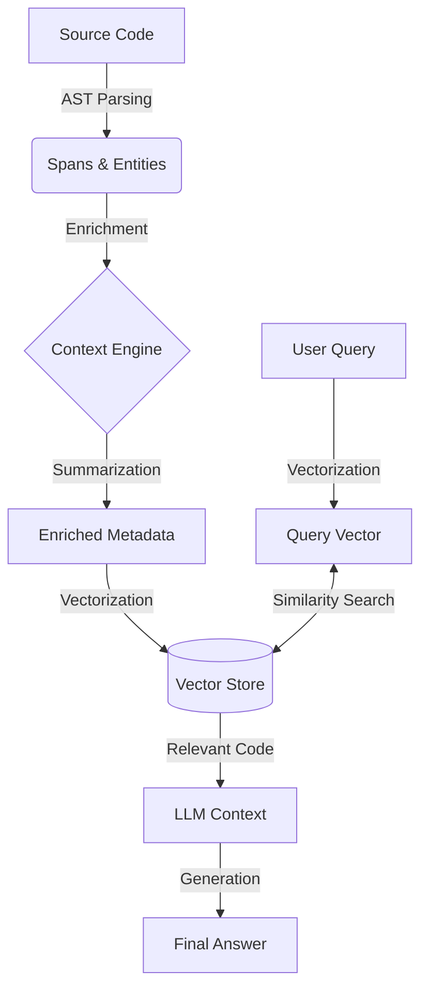

# Core Concepts

Understanding how LLMC works will help you get better answers and build more effective agents. This guide explains the mental model behind the tool.

## What is LLMC?

LLMC is a **Retrieval-Augmented Generation (RAG)** system designed specifically for codebases. While a standard Large Language Model (LLM) knows general programming patterns, it doesn't know *your* specific project. LLMC bridges this gap by indexing your code and allowing LLMs to "read" relevant parts of it when answering questions.

Think of it as adding a "long-term memory" of your entire repository to an AI assistant.

## The Mental Model

To use LLMC effectively, visualize the process in three stages:

1.  **Indexing (Ingestion):** LLMC reads your source code. Unlike a text editor that sees lines of text, LLMC parses the code to understand its structure (functions, classes, dependencies).
2.  **Understanding (Embeddings):** It converts these code structures into mathematical vectors called *embeddings*. These vectors capture the *meaning* of the code, not just the keywords.
3.  **Retrieval (Search):** When you ask a question, LLMC converts your query into a vector and finds the code vectors that are mathematically closest to it.

## Key Terminology

We use specific terms to describe how code is processed:

*   **Span:** A specific, contiguous segment of code. This could be a single function, a class definition, or a standalone script. Spans are the atomic units LLMC reads and retrieves.
*   **Embedding:** A list of numbers (a vector) that represents the semantic meaning of a Span. If two pieces of code do similar things (e.g., `def login()` and `sub authenticate()`), their embeddings will be similar, even if the words are different.
*   **Enrichment:** The process of adding context to a Span. Raw code often isn't enough; LLMC "enriches" it by adding summaries, dependency information, and usage examples to make it easier for the LLM to understand.
*   **Graph:** The network of relationships between Entities. This maps out "who calls whom," inheritance hierarchies, and import dependencies.
*   **Entity:** A distinct object in your code, such as a variable, function, class, or module.

## Semantic vs. Lexical Search

If you are used to tools like `grep` or `ripgrep`, you are used to **Lexical Search**.

*   **Lexical (grep):** Matches exact characters. If you search for "database connection", it looks for those exact letters. It will miss "db_link" or "sql_socket".
*   **Semantic (LLMC):** Matches intent and meaning. If you search for "database connection", LLMC understands the concept and might return a class named `PostgresPool` or a function `init_db()`, because they are semantically related to your query.

## How It Works

The following diagram illustrates the flow of data from your source files to the answers you receive:

