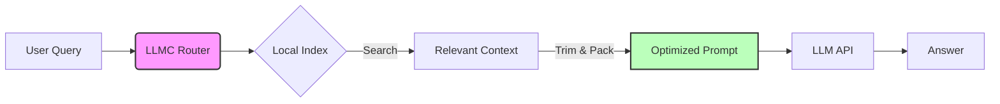

<div align="center">
  

  # LLMC: Large Language Model Compressor

  **Stop burning money on LLM tokens.**
  <br>
  Get 70-95% cost reduction through local RAG, intelligent routing, and containerized security.

  [](https://badge.fury.io/py/llmcwrapper)
  [](https://www.python.org/)
  [](LICENSE)
  [](tests/)

</div>

---

## ⚡ What is LLMC?

LLMC is a **local-first RAG (Retrieval Augmented Generation) engine** and intelligent router designed to drastically reduce the cost of using Large Language Models with your codebase.

Instead of sending your entire codebase to Claude or GPT-4, LLMC indexes your code locally, finds the exact relevant snippets (functions, classes, docs), and sends **only what matters**.



## 🚀 Quick Start

Get up and running in seconds.

### 1. Install
```bash
# One-line install
curl -sSL https://raw.githubusercontent.com/vmlinuzx/llmc/main/install.sh | bash

# Or via pip
pip install "git+https://github.com/vmlinuzx/llmc.git#egg=llmcwrapper[rag,tui,agent]"
```

### 2. Index Your Code
```bash
cd /path/to/your/project
llmc-cli repo register .
```

### 3. Save Money
```bash
# Search without using ANY tokens
llmc-cli search "authentication middleware"

# Launch the visual dashboard
llmc-cli tui
```

---

## ✨ Key Features

| Feature | Description |
| :--- | :--- |
| **💸 Massive Savings** | Reduces token usage by 70-95% by sending only relevant context. |
| **🔒 Security First** | **New in v0.7.0:** "Hybrid Mode" for trusted clients (host access) vs. Container Isolation for untrusted LLMs. |
| **🧠 Polyglot RAG** | Smart parsing (TreeSitter) for Python, TS, JS, Go, Java, and technical docs. |
| **🕸️ GraphRAG** | Understands your code structure (imports, calls, inheritance) to find related files automatically. |
| **🖥️ TUI Dashboard** | A beautiful terminal UI to monitor indexing, search results, and costs in real-time. |
| **🔌 MCP Support** | Full Model Context Protocol server to integrate seamlessly with Claude Desktop. |

---

## 🔍 Deep Dive

<details>
<summary><strong>🛠️ Core RAG Engine</strong></summary>

*   **Local SQLite Index:** Stores text + metadata without external dependencies.
*   **Smart Embeddings:** Caches embeddings to avoid re-computing unchanged files.
*   **Context Trimmer:** Packs the most relevant spans into a fixed token budget.
*   **Enrichment:** Uses small local models to tag and summarize code for better retrieval.

</details>

<details>
<summary><strong>🛡️ Security & MCP</strong></summary>

*   **Hybrid Mode:** Trusted clients get direct host access (~76% cheaper than docker overhead).
*   **Container Isolation:** Untrusted inputs run in Docker/nsjail.
*   **Defense in Depth:** Even if an LLM is "jailbroken" by prompt injection, it can't escape the container.

</details>

<details>
<summary><strong>📊 Analytics & Routing</strong></summary>

*   **Intelligent Failover:** Cascades from Local → Cheap Cloud → Premium Models.
*   **Cost Tracking:** Hard budget caps to prevent surprise bills.
*   **Rate Limiting:** Automatic token bucket throttling for API providers.

</details>

---

## 📚 Documentation

Full documentation is available in the [`DOCS/`](DOCS/index.md) directory:

- **[Getting Started](DOCS/getting-started/installation.md)** — Installation and quickstart
- **[User Guide](DOCS/user-guide/configuration.md)** — Configuration and daily usage
- **[Operations](DOCS/operations/daemon.md)** — Running the daemon and MCP integration
- **[Architecture](DOCS/architecture/index.md)** — System design and internals
- **[Reference](DOCS/reference/cli/index.md)** — CLI, config, and MCP tool reference

---

## 📜 History

Originally created by David Carroll (the worst paragliding pilot in the TX Panhandle) after burning through his weekly API limits in days. This tool was born from the necessity to code more while spending less.

---

## 🤝 Contributing

We welcome PRs! Please check `CONTRIBUTING.md` before starting.

1.  Fork the repo
2.  Create your feature branch (`git checkout -b feature/amazing-feature`)
3.  Commit your changes (`git commit -m 'Add some amazing feature'`)
4.  Push to the branch (`git push origin feature/amazing-feature`)
5.  Open a Pull Request

---

_Current Release: v0.7.0 "Trust Issues"_