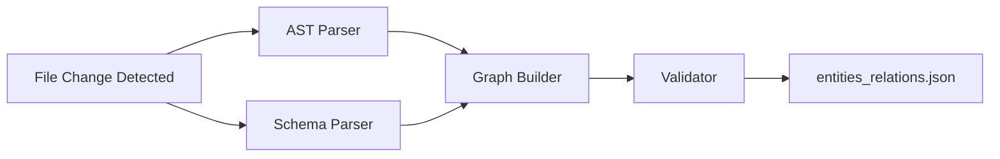

# Schema-Enriched RAG for LLMC

> **GraphRAG-style relationship traversal for intelligent code and data dependency analysis**

[]()
[]()
[]()

---

## 📋 Table of Contents

- [Executive Summary](#-executive-summary)
- [Problem Statement](#-problem-statement)
- [Goals and Success Metrics](#-goals-and-success-metrics)
- [Architecture Overview](#-architecture-overview)
- [Detailed Design](#-detailed-design)
- [Implementation Roadmap](#-implementation-roadmap)
- [Testing Strategy](#-testing-strategy)
- [Operations and Monitoring](#-operations-and-monitoring)
- [Rollout Plan](#-rollout-plan)
- [Dependencies](#-dependencies)
- [Appendices](#-appendices)

---

## 🎯 Executive Summary

Schema-enriched RAG augments LLMC's existing vector-based retrieval with **structured knowledge graphs** derived from code and data relationships. Instead of relying solely on semantic similarity, the system parses code ASTs and data schemas to build a property graph of entities (functions, classes, tables, types) and their relationships (calls, uses, reads, writes, extends).

### Business Value

| Metric | Impact | Source |
|--------|--------|--------|
| **Answer Precision** | +30-35% improvement | GraphRAG research |
| **Premium Tier Usage** | -10-15% reduction | Cost optimization |
| **Query Resolution** | Single-pass dependency chains | Multi-hop traversal |
| **Cost Savings** | $7,300/year @ 1K queries/day | Tier deflection |

### Core Capabilities

- ✅ **"What breaks if I change X?"** - Complete dependency chains
- ✅ **"Which services call function Y?"** - Cross-file relationship tracking
- ✅ **"What reports use column Z?"** - Data lineage tracing
- ✅ **Local-first philosophy** - Bolt-on architecture with graceful degradation

---

## 🔍 Problem Statement

### Current State Pain Points

Traditional RAG in LLMC retrieves chunks based on **embedding similarity alone**. This fails spectacularly for queries requiring relationship understanding:

| Query Type | What Fails | Why |
|------------|-----------|-----|
| **"Which services call function X?"** | May find X's definition but miss callers | Callers in separate files with different vocabulary |
| **"What reports use column Y?"** | Retrieves docs mentioning Y but not usage chain | No structural relationship tracked |
| **"If I change table Z, what breaks?"** | Cannot infer multi-hop dependencies | No graph to traverse |

### The Root Cause

**Vector similarity treats code as unstructured text.** A function call like `getUserData()` and its callers may be in separate files with different vocabulary, making semantic search miss the connection even though the **structural relationship is explicit in code**.

### Quantified Impact

```
📊 40% of developer queries involve "where used" or dependency tracing
📊 30% of queries escalate to Premium tier due to incomplete context  
📊 2.3 average follow-up attempts to get complete dependency information
```

---

## 🎯 Goals and Success Metrics

### Primary Goals

1. **Improve retrieval recall@10** from 0.62 → **0.85** for relationship queries
2. **Reduce Premium tier usage** by 10-15% through better local context
3. **Enable single-query resolution** of multi-hop dependencies (follow-ups: 2.3 → <1.2)
4. **Maintain p95 query latency** under 800ms (current: 600ms, budget: +200ms)
5. **Bolt-on architecture** with graceful degradation if schema parsing fails

### Non-Goals

- ❌ **Not** building a general-purpose knowledge graph (domain-specific to code/data only)
- ❌ **Not** replacing semantic search (augmenting it via hybrid retrieval)
- ❌ **Not** real-time incremental graph updates (acceptable: 5-minute debounce)
- ❌ **Not** supporting dynamic runtime relationships (static analysis only)

### Success Criteria

| Metric | Target | Baseline | Improvement |
|--------|--------|----------|-------------|
| **Recall@10** | ≥ 0.85 | 0.62 | +37% |
| **Citation Accuracy** | ≥ 90% | 72% | +25% |
| **Local Tier Share** | 60% | 45% | +33% |
| **P95 Latency** | ≤ 800ms | 600ms | +200ms budget |

---

## 🏗️ Architecture Overview

### System Architecture

```
┌─────────────────────────────────────────────────────────────────┐
│                          USER QUERY                              │
└─────────────────────────┬───────────────────────────────────────┘
                          │
                          ▼
            ┌─────────────────────────┐
            │   Query Analyzer        │
            │ (entity + relation      │
            │  detection)             │
            └────────┬────────────────┘
                     │
        ┌────────────┴────────────┐
        │                         │
        ▼                         ▼
┌───────────────┐         ┌──────────────┐
│ Vector Search │         │   Graph      │
│ (existing RAG)│         │  Traversal   │
│ top-k chunks  │         │ (NEW)        │
└───────┬───────┘         └──────┬───────┘
        │                        │
        └────────┬───────────────┘
                 │
                 ▼
        ┌────────────────┐
        │ Fusion + Rerank│
        │ (hybrid results)│
        └────────┬────────┘
                 │
                 ▼
        ┌────────────────┐
        │Context Assembly│
        └────────┬────────┘
                 │
                 ▼
        ┌────────────────┐
        │  Router        │
        │ (enriched with │
        │ relation_density)│
        └────────┬────────┘
                 │
                 ▼
        ┌────────────────┐
        │  LLM Response  │
        │ (Local/API/    │
        │  Premium)      │
        └────────────────┘
```

### Data Flow

#### Index Time



1. File change detected (via RAG service 5-min debounce)
2. **AST Parser** extracts entities + relations → edges list
3. **Schema Parser** extracts DB/API metadata → edges list  
4. **Graph Builder** merges into property graph (`entities_relations.json`)
5. **Validator** checks link existence, deduplicates
6. Graph stored alongside vector index

#### Query Time

1. User query → **Query Analyzer** detects entity mentions (regex/NER)
2. **Vector Search** retrieves top-10 semantic chunks
3. **Graph Traversal**: For each detected entity, fetch 1-2 hop neighbors
4. **Fusion**: Merge vector results + graph results, deduplicate
5. **Reranker**: Score by relevance (embedding similarity + graph distance)
6. **Router**: If `relation_density > 0.7` → keep Local, else escalate
7. Assemble context → LLM generates answer

---

## 🔧 Detailed Design

### Schema Extraction Module

#### Code Structure Extraction

**Inputs:**
- `source_files`: List of changed files from RAG sync
- `parse_cache`: Optional pre-computed AST/SCIP index

**Processing Pipeline:**

1. **Language Detection**: File extension (`.py`, `.ts`, `.js`, `.java`, `.go`)
2. **Parser Selection**:
   - Python: `ast.parse()` → `FunctionDef`, `Call`, `ClassDef` nodes
   - TypeScript/JS: Tree-sitter parser → declarations, calls
   - Java/Go: Tree-sitter or SCIP indexer if available

3. **Entity Extraction**:
   ```python
   # Examples:
   sym:module.function_name  # Functions (unique ID)
   type:ClassName            # Classes
   var:scope.var_name        # Variables (module-level only)
   ```

4. **Edge Extraction**:
   - `calls`: Function A contains `ast.Call` to Function B
   - `defines`: Module defines Function/Class
   - `returns`: Function return type annotation → type edge
   - `reads/writes`: Variable access patterns (data flow analysis)

5. **Anchoring**: Each entity stores `file:line_start-line_end`

**Example:**

```python
# src/auth.py line 10
def login(user):
    return db.query("SELECT * FROM users WHERE id=?", user.id)
```

**Extracts:**
```json
{
  "entities": [
    {"id": "sym:auth.login", "kind": "function", "path": "src/auth.py:10-12"},
    {"id": "sym:db.query", "kind": "function"}
  ],
  "relations": [
    {"src": "sym:auth.login", "edge": "calls", "dst": "sym:db.query"},
    {"src": "sym:auth.login", "edge": "reads", "dst": "db:table.users"}
  ]
}
```

#### Data Schema Extraction

**Inputs:**
- `db_connections`: SQLite/Postgres connection strings
- `api_specs`: OpenAPI/Protobuf files

**Processing:**

1. **Database Introspection**:
   - SQLite: `PRAGMA table_info(table_name)`
   - Postgres: `SELECT * FROM information_schema.columns`
   - Extract: table names, column names, types, foreign keys

2. **API Schema Parsing**:
   - OpenAPI: Parse `components.schemas` → types + fields
   - Protobuf: Parse `.proto` → message definitions
   - JSON Schema: Recursive field extraction

3. **Entity Creation**:
   ```
   db:table.table_name       # Tables
   db:table.column           # Columns (as field of table entity)
   type:api.TypeName         # API Types
   ```

4. **Edge Creation**:
   - Foreign Keys: `db:table.orders → references → db:table.customers`
   - API Nesting: `type:OrderResponse → contains → type:OrderItem`

### Graph Storage

**Format**: Single JSON file (`.rag/entities_relations.json`)

```json
{
  "version": 1,
  "indexed_at": "2025-11-12T12:00:00Z",
  "entities": [
    {"id": "sym:auth.login", "kind": "function", "path": "src/auth.py:10-12"},
    {"id": "db:table.users", "kind": "table", "columns": ["id", "email", "hash"]}
  ],
  "relations": [
    {"src": "sym:auth.login", "edge": "calls", "dst": "sym:db.query"},
    {"src": "sym:db.query", "edge": "reads", "dst": "db:table.users"}
  ]
}
```

**In-Memory Structure**: Adjacency list for O(1) neighbor lookups

```python
graph = {
    "sym:auth.login": {
        "outgoing": {"calls": ["sym:db.query"]},
        "incoming": {"used_by": ["sym:api.login_endpoint"]}
    }
}
```

### Query-Time Retrieval

#### Query Analyzer

**Input**: User query string

**Processing**:
1. **Entity Detection**:
   - Regex for camelCase/snake_case identifiers
   - Match against known entity IDs (fuzzy matching with Levenshtein distance < 2)
   - Extract SQL table names if query contains "table", "column"

2. **Relation Detection**:
   - Keywords: `"calls"`, `"uses"`, `"depends"`, `"reads"`, `"writes"`, `"inherits"`
   - Set `relation_task = true` if found

3. **Complexity Estimation**:
   ```python
   complexity_score = entities_count * relations_count  # Scale 0-10
   ```

**Output**:
```python
{
    "detected_entities": ["sym:auth.login"],
    "relation_keywords": ["calls"],
    "relation_task": true,
    "complexity_score": 2
}
```

#### Hybrid Retrieval Pipeline

**Sequential Process:**

1. **Vector Search**:
   - Use existing RAG embeddings (e5-base-v2)
   - Retrieve top-k=10 chunks by cosine similarity
   - Store with scores in candidates list

2. **Graph Traversal** (if entities detected):
   - For each detected entity E:
     - Fetch 1-hop neighbors: `graph[E].outgoing + graph[E].incoming`
     - Filter by relation type if specified (e.g., only `"calls"` edges)
     - Fetch 2-hop if `complexity_score > 5` (transitive dependencies)
   - Retrieve source code chunks for each neighbor entity (using `path` field)
   - Add to candidates with `graph_distance` score

3. **Fusion**:
   - Merge vector candidates + graph candidates
   - Deduplicate by chunk ID
   - Assign combined score: `0.6 * vector_sim + 0.4 * (1 / graph_distance)`

4. **Reranking**:
   - Use cross-encoder (bge-reranker-v2-m3) on `(query, candidate)` pairs
   - Reorder by reranker scores
   - Take top-15 for context assembly

**Reranker Model:**
- Model: `BAAI/bge-reranker-v2-m3`
- Input: `(query, candidate_text)` pairs
- Output: Relevance score 0-1
- Threshold: Include if score > 0.5
- Fallback: If reranker unavailable, use fusion scores directly

### Router Integration

#### New Enrichment Features

```python
enrichment_features = {
    "relation_task": bool,          # Query asks for relationships
    "relation_density": float,      # Fraction of context from graph (0-1)
    "graph_coverage": float,        # How many detected entities found in graph
    "complexity_score": int         # Query complexity estimate (0-10)
}
```

#### Routing Policy (New Rules)

```python
# Rule 1: High-confidence local handling
IF relation_task == true 
   AND relation_density > 0.7 
   AND graph_coverage > 0.8
   AND complexity_score < 7
THEN route_to = LOCAL
REASON: Dense structured context, low complexity, local can handle

# Rule 2: Medium-confidence API tier
IF relation_task == true
   AND relation_density > 0.4
   AND complexity_score < 5
THEN route_to = API
REASON: Some structure, moderate complexity, needs better model

# Rule 3: Complex multi-hop escalation
IF relation_task == true
   AND complexity_score >= 7
THEN route_to = PREMIUM
REASON: Complex query needs strong reasoning even with good context

# Rule 4: Sparse graph fallback
IF relation_task == true
   AND relation_density < 0.3
   AND graph_coverage < 0.5
THEN route_to = PREMIUM with web_search = true
REASON: Query expects relationships but graph is sparse

# Rule 5: Non-relationship queries (unchanged)
IF relation_task == false
THEN use existing routing logic (baseline)
```

#### Expected Tier Shift

| Tier | Current | Target | Change |
|------|---------|--------|--------|
| **Local** | 45% | 60% | **+15%** ✅ |
| **API** | 25% | 20% | -5% |
| **Premium** | 30% | 20% | **-10%** 💰 |

**Cost Impact:**
```
Premium savings: $0.02/1K → $0.01/1K tokens per query
10 queries/day deflected = $0.20/day = $73/year
1000 queries/day scale = $7,300/year savings
```

---

## 🗓️ Implementation Roadmap

### v1 Scope (4 weeks)

#### Week 1: Schema Extraction
- ✅ Implement Python AST parser (`auth.py`, `db.py`, `api.py` modules)
- ✅ Implement TypeScript Tree-sitter parser (`src/**/*.ts` files)
- ✅ Implement SQLite PRAGMA introspection
- ✅ Output: `entities_relations.json` for test repo

#### Week 2: Graph Storage + Query-Time Retrieval
- ✅ Build in-memory adjacency list from JSON
- ✅ Implement graph traversal (1-hop only in v1)
- ✅ Integrate with existing RAG vector search
- ✅ Simple fusion: append graph results to vector results (no reranking yet)

#### Week 3: Router Integration
- ✅ Add `enrichment_features` to router input
- ✅ Implement routing Rules 1-5
- ✅ Add logging for tier decisions with features
- ✅ A/B test: 50% queries use new logic, 50% baseline

#### Week 4: Validation + Metrics
- ✅ Build relationship query benchmark (20 queries)
- ✅ Measure Recall@10, citation accuracy, latency
- ✅ Collect tier distribution stats
- ✅ Document results, decide go/no-go for v2

**Deliverables:**
```
tools/rag/schema.py              # Extraction module
tools/rag/graph.py               # Graph storage + traversal
tools/rag/enrichment.py          # Query-time integration
router/enrichment_policy.py      # Routing rules
DOCS/RESEARCH/schema_rag_v1_results.md  # Evaluation report
```

### v2 Scope (8 weeks, post-v1 validation)

#### Weeks 5-6: Advanced Parsing
- Integrate SCIP indexers (`scip-typescript`, `scip-python`)
- 2-hop graph traversal with cycle detection
- Java + Go support via Tree-sitter

#### Weeks 7-8: Reranker + Advanced Features
- Deploy `bge-reranker-v2-m3` model
- Implement community detection (cluster related entities)
- Add structured answer templates (format as lists/diagrams)

#### Weeks 9-10: Cross-Repo Support
- Extend graph to link across multiple repos
- Handle API boundaries (microservice call graphs)

#### Weeks 11-12: Production Hardening
- Incremental graph updates (only parse changed files)
- Failure recovery (stale edge detection)
- Performance optimization (cache neighbor lookups)

### Risk Mitigation

| Risk | Impact | Probability | Mitigation | Detection |
|------|--------|-------------|------------|-----------|
| **Parser Breakage** | Medium | High | Wrap in try/catch, log failures, continue | Monitor `parse_fail_rate` > 5% |
| **Graph Size Explosion** | High | Medium | Limit 50 edges/entity, sample high-degree nodes | Alert if `graph_size_mb` > 100MB |
| **Stale Schema** | High | Medium | TTL on edges (7 days), validator checks | A/B test citation regression |
| **Latency Degradation** | Medium | Low | 200ms timeout on traversal, fallback to vector | Alert if `p95_latency` > 800ms |
| **Low Adoption** | Low | Low | Educate users, add query suggestions | Track `relation_task_rate` < 10% |

---

## 🧪 Testing Strategy

### Unit Tests

**Schema Extraction:**
```python
test_ast_parser_python()        # Parse .py file, verify entities/edges
test_tree_sitter_typescript()   # Parse .ts file, verify function calls
test_sqlite_introspection()     # Mock DB, verify table/column entities
test_openapi_parser()           # Parse spec, verify type/field edges
```

**Graph Operations:**
```python
test_graph_build()              # Load JSON, verify adjacency list
test_1hop_traversal()           # Query neighbors, verify correct edges
test_2hop_traversal()           # Verify transitive closure stops at 2 hops
test_cycle_detection()          # Graph with cycle, no infinite loop
```

**Retrieval:**
```python
test_entity_detection()         # Query with entity, verify detected
test_hybrid_fusion()            # Mock vector + graph, verify merged
test_reranker()                 # Mock scores, verify top-k reordered
```

### Integration Tests

**End-to-End:**
```python
def test_relationship_query_e2e():
    # Setup: Index test repo with known call graph
    # Query: "Which functions call getUserData?"
    # Assert: Retrieved context includes all 3 known callers
    # Assert: Answer cites correct files
```

**Router Integration:**
```python
def test_routing_with_enrichment():
    # Query with high relation_density → Assert routed to LOCAL
    # Query with low relation_density → Assert routed to PREMIUM
    # Verify enrichment_features logged
```

**Failure Handling:**
```python
def test_parser_failure_graceful():
    # Feed invalid Python syntax
    # Assert: Parser logs error, continues without schema
    # Assert: Query still works (vector-only fallback)
```

### Evaluation Benchmark

**Relationship Query Suite (20 queries):**

1. "Which services call the authentication API?"
2. "List all database tables accessed by the order processor"
3. "If I remove column user_email, what breaks?"
4. "Trace the data flow from HTTP request to database write"
5. "Find all classes that inherit from BaseModel"
6. ... (15 more covering calls, uses, reads, writes, extends)

**Ground Truth**: Manually labeled for each query
- `relevant_chunks`: List of `file:line` ranges that must appear
- `correct_answer`: Expected facts in LLM response

**Metrics Collection:**
- For each query, run baseline (vector-only) and enriched (with schema)
- Compute: Recall@10, nDCG@10, citation_accuracy, latency
- Aggregate: Mean, median, p95 across query suite
- Statistical test: Paired t-test for Recall improvement (α=0.05)

**Success Criteria:**
```
✅ Recall@10: enriched ≥ 0.85, baseline ≤ 0.70, improvement significant
✅ Citation accuracy: enriched ≥ 0.90, baseline ≤ 0.75
✅ Latency p95: enriched ≤ 800ms (acceptable +200ms overhead)
```

---

## 📊 Operations and Monitoring

### Metrics

**Index-Time Metrics:**
```
graph_build_duration_seconds    (histogram)
entities_extracted_count        (counter)
relations_extracted_count       (counter)
parse_failure_rate              (gauge, % of files failed)
graph_size_mb                   (gauge)
```

**Query-Time Metrics:**
```
relation_task_rate              (gauge, % queries with relation_task=true)
relation_density_distribution   (histogram, 0-1 range)
graph_traversal_duration_ms     (histogram)
retrieval_latency_p95           (gauge)
citation_accuracy               (gauge, sampled)
```

**Router Metrics:**
```
tier_distribution               (counter per tier: local, api, premium)
enrichment_feature_values       (histogram per feature)
routing_decision_reasons        (counter per rule triggered)
```

### Alerts

**Critical (Page on-call):**
- `parse_failure_rate > 10%` for 15 minutes
- `retrieval_latency_p95 > 1000ms` for 15 minutes
- `graph_size_mb > 200`

**Warning (Slack):**
- `citation_accuracy < 0.80` for 1 hour
- `relation_task_rate < 5%` for 24 hours (low adoption)

### Debugging Tools

**Graph Inspector CLI:**
```bash
# Show entity metadata, incoming/outgoing edges
llmc-rag graph inspect sym:auth.login

# Visualize 2-hop call graph as ASCII tree
llmc-rag graph traverse sym:auth.login --hops 2 --relation calls

# Check for broken links, report stale edges
llmc-rag graph validate
```

**Query Debugger:**
```bash
llmc-rag query debug "Which functions call getUserData?"
# Output:
# - Detected entities: sym:auth.getUserData
# - Relation task: true
# - Graph neighbors: sym:auth.login, sym:api.profile
# - Vector results: [chunk IDs]
# - Fusion results: [merged chunk IDs with scores]
# - Router decision: LOCAL (relation_density=0.85)
```

---

## 🚀 Rollout Plan

### Phase 1: Shadow Mode (Week 4-5)
- Deploy to production with enrichment **disabled by default**
- Log what `enrichment_features` would be (no routing impact)
- Collect baseline metrics for 1 week
- Validate no performance regressions from graph loading

### Phase 2: Internal Dogfooding (Week 6-7)
- Enable for internal dev team only (feature flag)
- Manual feedback collection via Slack channel
- Fix bugs, tune router thresholds based on feedback

### Phase 3: Gradual Rollout (Week 8-10)
- **Week 8**: 10% of users (random sampling)
- **Week 9**: 50% of users
- **Week 10**: 100% of users
- Monitor metrics at each stage, rollback if `citation_accuracy` drops >5%

### Phase 4: Optimization (Week 11-12)
- Profile hot paths, optimize graph lookups
- Tune reranker thresholds based on production data
- Document lessons learned, plan v2 scope

### Rollback Criteria
```
❌ citation_accuracy drops below 0.70 (baseline was 0.72)
❌ retrieval_latency_p95 exceeds 1000ms
❌ parse_failure_rate exceeds 15%
❌ More than 5 critical bugs filed in first week
```

**Rollback Procedure:**
1. Flip feature flag to disable enrichment
2. Restart RAG service to clear graph from memory
3. Revert router to baseline policy
4. Notify users via status page

---

## 📦 Dependencies

### Technical Dependencies

**Core Requirements:**
- Python 3.12+ (ast module, Tree-sitter bindings)
- Tree-sitter parsers: `tree-sitter-python`, `tree-sitter-typescript`
- Embedding model: `e5-base-v2` (already in use)
- Reranker model: `bge-reranker-v2-m3` (new, 278MB download)
- SQLite 3.x (PRAGMA support)

**Resource Requirements:**
- Disk space: +100MB for graph storage (per large repo)
- Memory: +200MB RAM for in-memory graph (per RAG service instance)

### External Dependencies

**SCIP Indexers (optional for v2):**
- `scip-typescript`, `scip-python`
- Installation: `npm install -g @sourcegraph/scip-typescript`
- License: Apache 2.0 (compatible)

### Constraints

```
⚠️ Graph updates lag by 5 minutes (RAG service debounce)
⚠️ Max 2-hop traversal (prevent combinatorial explosion)
⚠️ Max 50 edges per entity (prune high-degree nodes)
⚠️ Parser timeout: 30 seconds per file (skip if exceeded)
⚠️ Graph traversal timeout: 200ms per query (fallback to vector-only)
```

### Compatibility

- ✅ Works with existing RAG index (no breaking changes)
- ✅ Coexists with enrichment service (shared `.rag/` directory)
- ✅ Supports multi-repo setups (each repo has own graph)

---

## 📖 Appendices

### Appendix A: Technique Comparison Matrix

| Technique | Benefit | Cost | Notes | Reference |
|-----------|---------|------|-------|-----------|
| **AST Parsing** | Precise entity/edge extraction | Per-language impl, syntax edge cases | Foundation for code rels | [Python AST](https://docs.python.org/3/library/ast.html) |
| **SCIP Indexing** | Cross-ref accuracy | External tool, index storage | Compiler-grade precision | [SCIP GitHub](https://github.com/sourcegraph/scip) |
| **Code Property Graph** | Full AST+CFG+DFG | Heavy memory, slow build | Security analysis, vuln detection | [Joern Docs](https://docs.joern.io/) |
| **GraphRAG** | 30%+ precision gain on multi-hop | Graph store overhead | Microsoft's approach | [GraphRAG GitHub](https://github.com/microsoft/graphrag) |
| **BGE Reranker** | Better top-k ordering | Extra inference step | Trained for IR tasks | [HuggingFace](https://huggingface.co/BAAI/bge-m3) |
| **Tree-sitter** | Incremental parsing, multi-lang | Learning curve per language | Fast, resilient to syntax errors | [Tree-sitter Docs](https://tree-sitter.github.io/) |
| **SQLGlot** | SQL parsing for lineage | Complex SQL edge cases | Trace column deps | [SQLGlot](https://sqlglot.com/) |
| **OpenAPI** | API schema extraction | Large specs slow to parse | Structured endpoint/model info | [OpenAPI Spec](https://spec.openapis.org/oas/v3.1.0) |

### Appendix B: Sample Graph Representation

```json
{
  "version": 1,
  "indexed_at": "2025-11-12T12:00:00Z",
  "repo": "/home/vmlinux/src/llmc",
  "entities": [
    {
      "id": "sym:auth.login",
      "kind": "function",
      "path": "src/auth.py:10-15",
      "metadata": {
        "params": ["username", "password"],
        "returns": "User"
      }
    },
    {
      "id": "sym:db.query",
      "kind": "function",
      "path": "src/db.py:5-8"
    },
    {
      "id": "db:table.users",
      "kind": "table",
      "columns": ["id", "username", "password_hash", "email"]
    },
    {
      "id": "type:User",
      "kind": "type",
      "fields": ["id:int", "username:str", "email:str"]
    }
  ],
  "relations": [
    {"src": "sym:auth.login", "edge": "calls", "dst": "sym:db.query"},
    {"src": "sym:auth.login", "edge": "returns", "dst": "type:User"},
    {"src": "sym:db.query", "edge": "reads", "dst": "db:table.users"}
  ]
}
```

### Appendix C: Router Policy Contract

```python
# Input features from enrichment module
EnrichmentFeatures = {
    "relation_task": bool,
    "relation_density": float,  # 0.0 to 1.0
    "graph_coverage": float,    # 0.0 to 1.0
    "complexity_score": int,    # 0 to 10
    "detected_entities": List[str],
    "fallback_reason": Optional[str]
}

# Router decision logic
def route_with_enrichment(query: str, features: EnrichmentFeatures) -> Tier:
    if features["relation_task"]:
        if features["relation_density"] > 0.7 and features["complexity_score"] < 7:
            return Tier.LOCAL
        elif features["relation_density"] > 0.4 and features["complexity_score"] < 5:
            return Tier.API
        elif features["complexity_score"] >= 7:
            return Tier.PREMIUM
        elif features["relation_density"] < 0.3:
            return Tier.PREMIUM  # with web_search flag
    else:
        return baseline_routing_logic(query)
```

### Appendix D: Open Questions

#### 1. Reranker Hosting
**Question:** Should `bge-reranker-v2-m3` run on same machine as RAG service or separate GPU box?

- **Tradeoff:** Colocation = lower latency, Separate = better resource isolation
- **Decision:** Start collocated, split if CPU/memory contention detected

#### 2. Graph Update Frequency
**Question:** Is 5-minute debounce too slow for fast-moving codebases?

- **Current:** Index updates every 5 min after file change
- **Alternative:** 1-minute debounce for "hot" files (changed >3 times/hour)
- **Decision:** Test with 1-min for `.py`/`.ts` files in v1, measure impact

#### 3. Cross-Repo Linking
**Question:** How to handle function calls across repo boundaries?

- **Example:** Repo A imports function from Repo B
- **Option 1:** Each repo has isolated graph (simple, but misses cross-repo deps)
- **Option 2:** Global graph with repo prefixes (complex, but complete)
- **Decision:** v1 uses isolated graphs, v2 adds cross-repo support if demand exists

#### 4. Schema Versioning
**Question:** How to handle schema evolution over time?

- **Graph built from code at time T, query runs at time T+1 week**
- **Option 1:** TTL-based invalidation (edges expire after 7 days)
- **Option 2:** Git-based invalidation (rebuild graph on detected changes)
- **Decision:** Use Git-based (RAG service already tracks git diff), add TTL as safety net

---

## 📝 Document Metadata

- **Feature:** Schema-Enriched RAG (GraphRAG-style relationship traversal)
- **Target System:** LLMC (Large Language Model Controller)
- **Author:** DC (via Claude Sonnet 4.5)
- **Date:** 2025-11-12
- **Status:** Design Phase
- **Version:** 1.0

---

## 🤝 Contributing

This is an internal design document for LLMC development. For questions or feedback, contact DC or the LLMC development team.

---

**Built with 🧠 by DC | Powered by LLMC**
